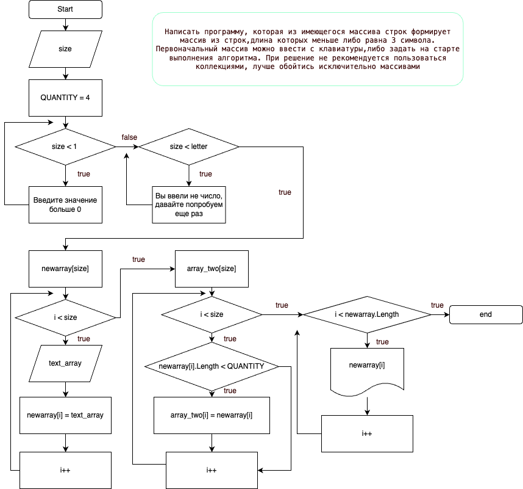

# Задача
Написать программу, которая из имеющегося массива строк формирует массив из строк,длина которых меньше либо равна 3 символа. Первоначальный массив можно ввести с клавиатуры,либо задать на старте выполнения алгоритма. При решение не рекомендуется пользоваться коллекциями, лучше обойтись исключительно массивами

1. Создать репозиторий GitHub
2. Нарисовать блок-схему алгоритма \
Скачать блок-схему можно тут - https://disk.yandex.ru/i/4ny7YzAkUVOh5w

3. Добавить файл README.MD
4. Написать программу
5. Написать с коммитами

Задача выполнена на 100% для себя усложнял разными проверками, на ввод букв, чисел меньше 0 \
Впервые использовал try